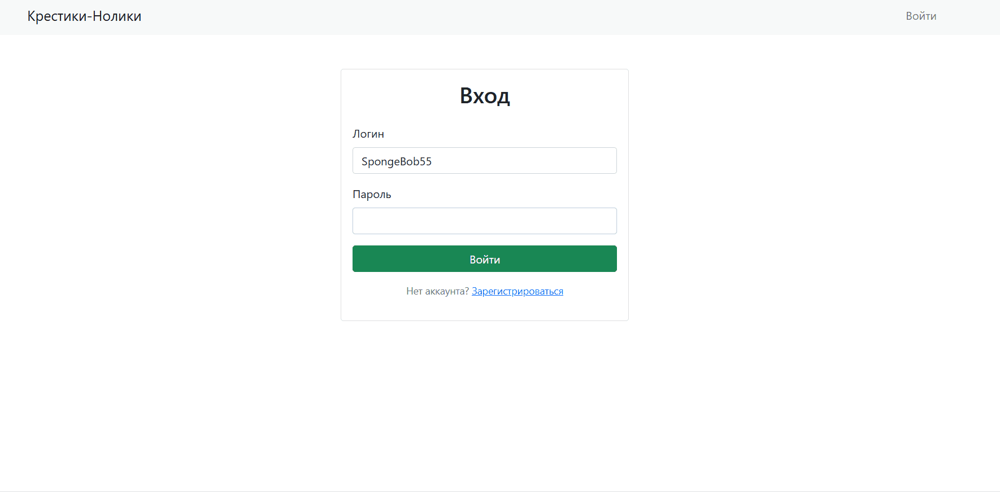
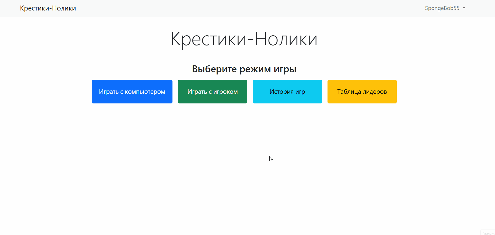
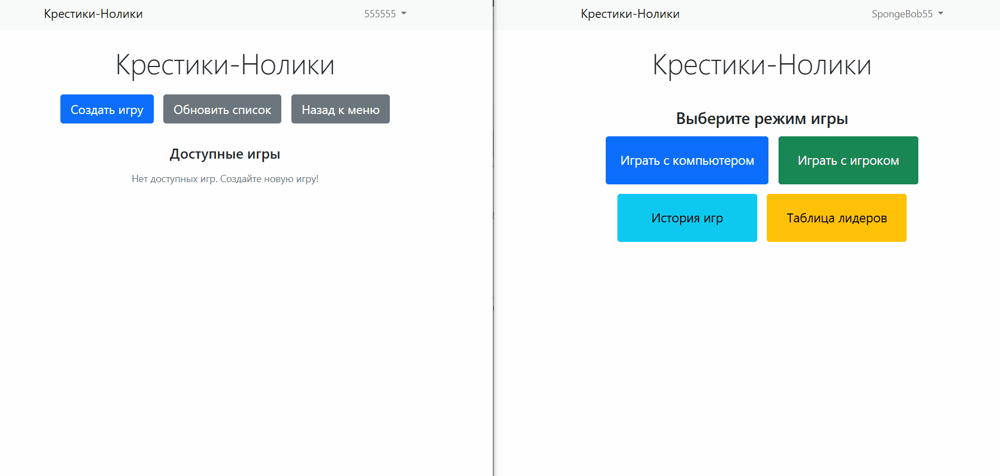
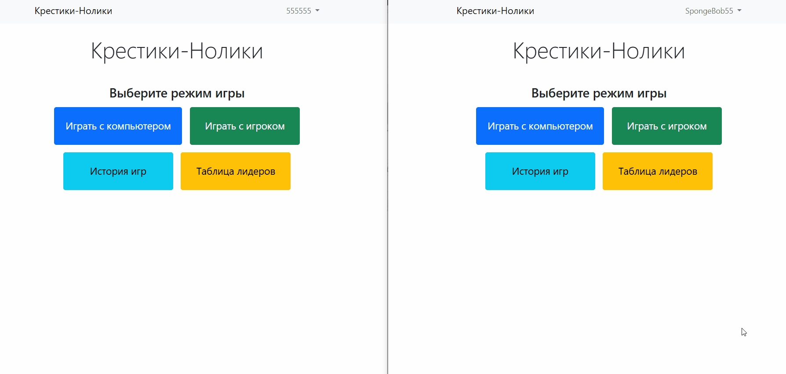
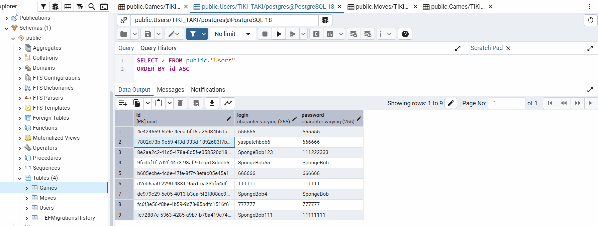

# Tic-Tac-Toe Game

Tic-Tac-Toe Game — веб-приложение для игры в крестики-нолики, разработанное на ASP.NET Core. Проект поддерживает два игровых режима: игру против компьютера и игру между двумя пользователями. Для авторизованных пользователей доступно сохранение истории игр, просмотр личной статистики и таблицы лидеров.

В приложении реализована система аутентификации и авторизации на основе JWT-токенов, автоматическое сохранение состояния игр в базе данных PostgreSQL и REST API для взаимодействия с игровым процессом и статистикой.

В процессе разработки функциональность добавлялась поэтапно:
- **Игра против компьютера (branch:play_with_computer)** — с использованием алгоритма Minimax для оптимальных ходов компьютера
- **Игра между двумя игроками (branch:with-postgres)** — поддержка многопользовательского режима
- **JWT-авторизация и статистика (branch:main)** — расширенная версия с токенами доступа, историей игр и таблицей лидеров

## UI
### Аутентификация и регистрация

### Игрок против компьютера

### Игрок против игрока

### Механика при выходе одного из игроков

### PostgreSQL

## Технологии

- **Backend:**
  - C# (.NET 8.0)
  - ASP.NET Core 8.0 (Razor Pages + REST API)
  - Entity Framework Core 8.0
  - JWT (JSON Web Tokens) для авторизации
  - PostgreSQL (с JSONB для хранения игровых данных)
  
- **Frontend:**
  - Razor Pages
  - JavaScript (ES6+)
  - Bootstrap 5
  
- **Архитектура:**
  - Многослойная архитектура (Domain, DataSource, Web)
  - Repository Pattern
  - Dependency Injection
  - Mapper Pattern

## Основные возможности

- Регистрация пользователей
- JWT-авторизация (access token + refresh token)
- Обновление токенов без повторной аутентификации
- Игра против компьютера с алгоритмом Minimax
- Игра между двумя игроками
- Валидация игровых ходов
- Сохранение истории ходов
- История завершенных игр для каждого пользователя
- Таблица лидеров с рейтингом игроков (соотношение побед к поражениям и ничьим)
- Автоматическая инициализация базы данных
- REST API для работы с играми и статистикой

## Ключевые особенности реализации

### 1. JWT-авторизация
Реализована полноценная JWT-аутентификация:
- Генерация access token (короткоживущий) и refresh token (долгоживущий)
- Хранение UUID пользователя в claims токена
- Эндпоинты для регистрации, входа, обновления access token и refresh token
- Bearer-авторизация для защиты API-эндпоинтов

### 2. Многослойная архитектура
Проект разделен на три основных слоя (Domain, DataSource, Web) с четким разделением ответственности, что обеспечивает тестируемость и поддерживаемость кода.

### 3. Алгоритм Minimax
Реализован AI-противник на алгоритме Minimax для поиска оптимальных ходов компьютера в игре против человека.

### 4. Работа с PostgreSQL и JSONB
Настроена работа с PostgreSQL через EF Core:
- Автоматическая инициализация БД при старте приложения
- Миграции для управления схемой БД
- Кастомные конвертеры данных для преобразования сложных типов (двумерные массивы, списки) в формат JSONB PostgreSQL

### 5. История игр и таблица лидеров
- Автоматический сбор завершенных игр (победа/ничья)
- Подсчет соотношения побед к общему количеству игр для каждого пользователя
- Формирование рейтинга лучших игроков с возможностью ограничения выборки (TOP N)
- Защита статистических эндпоинтов с помощью JWT
